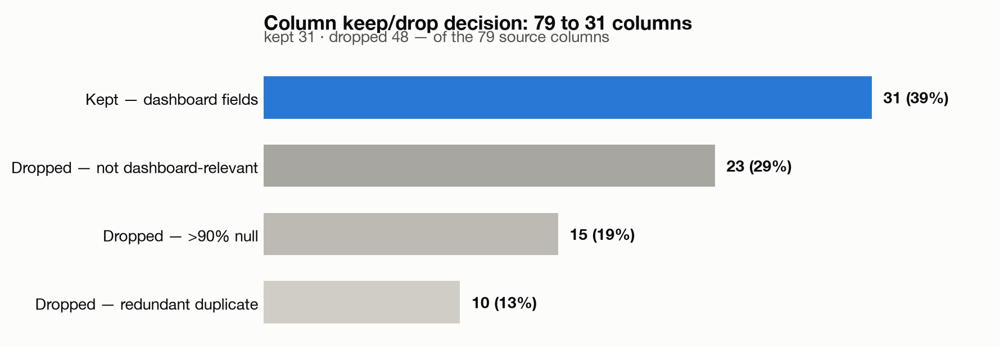
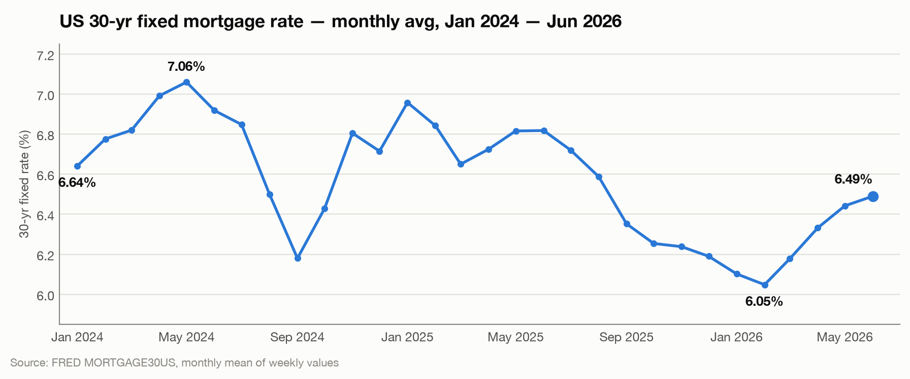
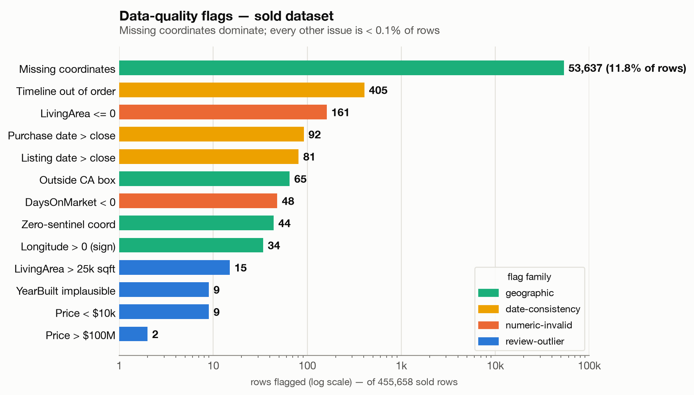

# IDX Exchange · Data Analyst Internship

Real estate market intelligence through MLS analytics.
Summer 2026 · Python · pandas · Tableau · CoreLogic Trestle API

## About

A 12-week data analyst internship at IDX Exchange, a real estate technology company, focused on turning raw CRMLS (California Regional Multiple Listing Service) data into market intelligence. The pipeline moves raw MLS pulls → Python extraction and consolidation → two canonical datasets → Tableau Public dashboards.

> No proprietary MLS data, API credentials, or client records are stored in this repository. Raw CSVs are produced and kept **local only**.

## Objectives

- Pull **listings** and **sold** MLS records from the CoreLogic Trestle API.
- Maintain two canonical, ever-growing datasets — listings (everything on the market) and sold (only closed transactions) — as **separate pipelines**.
- Filter and standardize the data for analysis.
- Build and publish market dashboards on Tableau Public.

## Repository structure

```
week0/
  crmls_listed.py        # extraction → monthly listings CSV
  crmls_sold.py          # extraction → monthly sold CSV
week1/
  concatenate_monthly.py # combine all months → listings.csv + sold.csv (Residential only)
week2-3/
  common.py              # shared file-discovery + column keep-list (single source of truth)
  dataset_structuring.py # structure/validate sold, document types, filter, EDA, column-drop → reduced CSV
  mortgage_enrichment.py # merge FRED 30yr mortgage rate onto sold + listings → enriched CSVs
  make_figures.py        # README figures (column keep/drop, mortgage-rate line)
week4-5/
  data_cleaning.py       # type dates/numerics, flag quality issues, emit flagged + clean-view CSVs
  make_figures.py        # README figure (data-quality flag prevalence)
```

Data CSVs, Excel files, and Tableau `.twbx` workbooks are gitignored — this repo holds code and documentation only.

## The two-pipeline model

Two separate scripts, because listings and sold are two fundamentally different slices of the data:

- **Listings** — the full universe of properties placed on the market, regardless of outcome.
- **Sold** — the narrower subset that actually closed.

There are two canonical **raw** datasets — `listings.csv` and `sold.csv` — which each month's pull grows in place. Later stages derive enriched and cleaned versions *from* them (reduced → rate-enriched → flagged + clean-view; see Weeks 2–5), always as separate downstream artifacts, never by mutating the raw pair.

## Weekly workflow (end to end)

1. Run the two extraction scripts → update the two raw datasets.
2. Run the downstream stages (Weeks 2–5) to produce the enriched, cleaned versions.
3. Near the end of the internship, load the two Weeks 4–5 **clean-view** CSVs into **Tableau Public Desktop**.
4. Save the full working workbook as a `.twbx` (all worksheets visible).
5. Save a second `.twbx` with worksheets hidden and only dashboards visible.
6. Publish that version to **public.tableau.com**.

## How to run

Requires Python 3 with `requests` and `pandas` (plus `matplotlib` for the figure scripts).

```bash
pip install requests pandas matplotlib

# The Trestle proxy key is NOT stored in this repo — set it in your shell:
export TRESTLE_PROXY_KEY="<your IDX Exchange proxy key>"

# Week 0 — pull monthly files (defaults to 202602–202605; pass any YYYYMM args):
python3 week0/crmls_listed.py 202602 202603 202604 202605
python3 week0/crmls_sold.py   202602 202603 202604 202605

# Week 1 — combine all monthly files and filter to Residential.
# Point CRMLS_DATA_DIR at the folder of monthly CRMLS*.csv files:
export CRMLS_DATA_DIR="/path/to/monthly/files"
python3 week1/concatenate_monthly.py

# Weeks 2–3 — structure/reduce sold, then enrich both datasets with FRED rates:
export CRMLS_OUTPUT_DIR="/path/to/deliverables"
python3 week2-3/dataset_structuring.py
python3 week2-3/mortgage_enrichment.py

# Weeks 4–5 — type, flag, and emit flagged + clean-view CSVs
# (reads the Weeks 2–3 "With Rates" files from CRMLS_DELIV_DIR):
export CRMLS_DELIV_DIR="$CRMLS_OUTPUT_DIR"
python3 week4-5/data_cleaning.py
```

---

## Weekly progress

### Week 0 — Extraction scripts

**Original brief:** the two extraction scripts were hardcoded to February 2026 and crashed with an `SSLEOFError` whenever the API dropped the connection. Both were rewritten so they:

- Accept one or more **`YYYYMM`** arguments from the command line (no more hardcoded month); output filenames derive from the month.
- Wrap every request in **retry + exponential backoff**, surviving dropped connections (the `SSLEOFError` / `SSLError` case, plus HTTP 429/5xx and mid-pull token expiry) instead of crashing.
- Read the API key from an **environment variable** rather than hardcoding it.

The scripts were then run to pull the Sold and Listing files for 202602–202605. Combined with the historical files retrieved via FileZilla, the team dataset now spans **January 2024 → May 2026**.

### Week 1 — Consolidation + Residential filter

**Deliverable:** `week1/concatenate_monthly.py` concatenates every monthly file (January 2024 through the most recently completed calendar month) into one **listings** and one **sold** dataset, filters both to `PropertyType == 'Residential'`, and writes the two CSVs — printing row counts at four checkpoints (before/after concatenation, before/after the filter) and recording them in the script's RUN LOG.

Observed on the 29-month set (Jan 2024 – May 2026):

| Dataset  | Monthly files | After concatenation | Residential (kept) |
|----------|--------------:|--------------------:|-------------------:|
| Listings | 29            | 729,251             | **480,383** (~66%) |
| Sold     | 29            | 655,362             | **438,115** (~67%) |

*(Totals as of the original 29-month set; June 2026 was added in Weeks 2–3 — see the lineage notes there.)*

**Interpretation & insights**

- **Two source encodings.** The historical FileZilla files are **Windows-1252**, while the API-extraction files are **UTF-8**. A naive read crashes on byte `0x92` (a smart quote). The script reads each file as UTF-8 with a **cp1252 fallback** and writes clean UTF-8 — a real data-quality gotcha the team should standardize on going forward.
- **Concatenation is lossless** — the sum of the individual files equals the concatenated count for both datasets, confirming no rows are dropped on load.
- **`PropertyType` categorization.** Keeping only `Residential` removes roughly a third of all rows. The categories filtered out are `ResidentialLease`, `Land`, `ResidentialIncome`, `ManufacturedInPark`, `CommercialSale`, `CommercialLease`, and `BusinessOpportunity`. `Residential` still spans every residential subtype (single-family, condo, townhouse, etc.).
- **Stable residential share** across both slices (~66–67%), a sensible baseline for the market-level dashboards to come.

### Weeks 2–3 — Dataset structuring/validation + mortgage-rate enrichment

Two scripts plus a shared `common.py` (single source of truth for file discovery and the column keep-list). The first inspects, validates, and reduces the **sold** dataset; the second enriches **both** datasets with mortgage rates. Data now spans **Jan 2024 – June 2026 (30 months)** — the June 2026 files are picked up via a `YYYYMM` dedup across two data folders so newly-arrived months integrate without double-counting stale duplicates.

**`week2-3/dataset_structuring.py`** reads the 30 monthly Sold files **un-filtered** (so the property-type mix can be documented and the Residential filter genuinely demonstrated), then: reports structure (680,885 rows × 79 cols), documents all 8 property types, applies `PropertyType == 'Residential'`, builds null tables **before and after** the filter (flagging >90%-null columns), produces a numeric distribution summary for `ClosePrice`/`LivingArea`/`DaysOnMarket`, answers six EDA questions, applies the **column-drop decision**, and saves the reduced dataset.

| Property type (sold) | Rows | Share |
|---|--:|--:|
| Residential | 455,658 | 66.92% |
| ResidentialLease | 157,408 | 23.12% |
| Land | 22,173 | 3.26% |
| ManufacturedInPark | 18,564 | 2.73% |
| ResidentialIncome | 18,521 | 2.72% |
| CommercialSale / CommercialLease / BusinessOpportunity | 8,561 | 1.26% |

<sub>Shares are rounded and may not sum to exactly 100%.</sub>

Residential filter kept **455,658** rows — an exact match to a teammate's independent 30-month result, asserted in-script as a continuity check (baseline lineage: 438,115 @ 29 mo → 455,658 @ 30 mo).

**Column-drop decision (79 → 31 columns).** Per the handbook clarification — drop columns >90% null, and keep only fields that feed the **Market Analysis** and **Competitive Analysis** dashboards — a 4-specialist review pruned the sold table to 31 columns: dropped **15** >90%-null columns plus **33** redundant/non-dashboard fields (kept one canonical each for id `ListingKey`, lot size `LotSizeSquareFeet`, list-agent `ListAgentFullName`; dropped amenities, schools, HOA, tax, address, co-agent, and originating-system fields).



**The 31 columns kept** (by dashboard purpose):

| Purpose | Columns |
|---|---|
| id / join key | `ListingKey` |
| price | `ClosePrice`, `ListPrice`, `OriginalListPrice` |
| dates + time-on-market | `CloseDate`, `ListingContractDate`, `PurchaseContractDate`, `DaysOnMarket` |
| status + product mix | `MlsStatus`, `PropertyType`, `PropertySubType` |
| size / attributes | `LivingArea`, `LotSizeSquareFeet`, `BedroomsTotal`, `BathroomsTotalInteger`, `YearBuilt` |
| geography | `CountyOrParish`, `City`, `PostalCode`, `StateOrProvince`, `MLSAreaMajor`, `Latitude`, `Longitude` |
| competitive — offices | `ListOfficeName`, `BuyerOfficeName` |
| competitive — agents | `ListAgentFullName`, `ListAgentAOR`, `BuyerAgentFirstName`, `BuyerAgentLastName`, `BuyerAgentMlsId`, `BuyerAgentAOR` |

**The 48 columns dropped** (by reason):

| Reason | Columns |
|---|---|
| >90% null (15) | `WaterfrontYN`, `BasementYN`, `FireplacesTotal`, `AboveGradeFinishedArea`, `TaxAnnualAmount`, `BuilderName`, `TaxYear`, `BuildingAreaTotal`, `ElementarySchoolDistrict`, `CoBuyerAgentFirstName`, `BelowGradeFinishedArea`, `BusinessType`, `CoveredSpaces`, `LotSizeDimensions`, `MiddleOrJuniorSchoolDistrict` |
| redundant duplicate (10) | `ListingKeyNumeric`, `ListingId` (→`ListingKey`); `LotSizeAcres`, `LotSizeArea` (→`LotSizeSquareFeet`); `ListAgentFirstName`, `ListAgentLastName` (→`ListAgentFullName`); `UnparsedAddress`, `StreetNumberNumeric`; `OriginatingSystemName`, `OriginatingSystemSubName` |
| not dashboard-relevant (23) | `Flooring`, `ViewYN`, `PoolPrivateYN`, `CoListOfficeName`, `CoListAgentFirstName`, `CoListAgentLastName`, `AssociationFeeFrequency`, `ElementarySchool`, `AttachedGarageYN`, `ParkingTotal`, `SubdivisionName`, `BuyerOfficeAOR`, `ContractStatusChangeDate`, `MiddleOrJuniorSchool`, `FireplaceYN`, `Stories`, `HighSchool`, `Levels`, `MainLevelBedrooms`, `NewConstructionYN`, `GarageSpaces`, `HighSchoolDistrict`, `AssociationFee` |

**`week2-3/mortgage_enrichment.py`** fetches the FRED `MORTGAGE30US` 30-year fixed series (weekly, no API key), resamples it to monthly averages (664 months, 1971→2026), rebuilds the reduced Residential sold + listings via `common`, and left-merges the rate on a `year_month` key (sold←`CloseDate`, listings←`ListingContractDate`). Validation confirmed **0 null rates** on both (455,658 sold, 504,466 listings; listings lineage: 480,383 @ 29 mo → 504,466 @ 30 mo).

Only the **30 months that overlap the MLS data (Jan 2024 – Jun 2026)** are joined onto transactions. Over that window the 30-yr fixed rate ranged **6.05% (Feb 2026, low) → 7.06% (May 2024, high)**, ending at **6.49%** (Jun 2026):



<sub>Source: FRED `MORTGAGE30US` (weekly, Freddie Mac) resampled to a monthly average.</sub>

| Month | Rate | Month | Rate | Month | Rate |
|---|--:|---|--:|---|--:|
| 2024-01 | 6.64% | 2024-11 | 6.80% | 2025-09 | 6.35% |
| 2024-02 | 6.78% | 2024-12 | 6.71% | 2025-10 | 6.25% |
| 2024-03 | 6.82% | 2025-01 | 6.96% | 2025-11 | 6.24% |
| 2024-04 | 6.99% | 2025-02 | 6.84% | 2025-12 | 6.19% |
| 2024-05 | **7.06%** | 2025-03 | 6.65% | 2026-01 | 6.10% |
| 2024-06 | 6.92% | 2025-04 | 6.72% | 2026-02 | **6.05%** |
| 2024-07 | 6.85% | 2025-05 | 6.82% | 2026-03 | 6.18% |
| 2024-08 | 6.50% | 2025-06 | 6.82% | 2026-04 | 6.33% |
| 2024-09 | 6.18% | 2025-07 | 6.72% | 2026-05 | 6.44% |
| 2024-10 | 6.43% | 2025-08 | 6.59% | 2026-06 | 6.49% |

**Insights**
- **`>90%`-null flags shift with the population** (14 columns before the filter, 15 after — `BuildingAreaTotal` only crosses the line once non-Residential rows are removed), so the report keeps a null table for each stage.
- **EDA surfaced real dirt for the Weeks 4–5 cleaning phase** (flagged, not fixed): `DaysOnMarket` as low as **−288**, `LivingArea` of **0** and up to **17M** sqft, and 81 sold records with `CloseDate` before `ListingContractDate`.
- **Market read (Residential sold):** median close price **$815K**; days-on-market median **19**; **39.5%** closed above list vs **42.8%** below; Bay-Area counties lead on median price (Del Norte tops the list but on a tiny sample — an outlier to treat with care).
- **The mortgage merge is a clean monthly join** — every transaction month is covered by FRED, so no rows fall through.
- **Adding June was a clean, verifiable increment** — the new totals reproduce a teammate's independent numbers to the row, confirming both pipelines agree.

### Weeks 4–5 — Data cleaning & preparation

**`week4-5/data_cleaning.py`** takes the Weeks 2–3 enriched datasets and prepares them for reliable analytics — **non-destructively**. It types the columns (dates → `datetime`, numerics → numeric), adds a boolean **flag** column for every quality issue, and emits two artifacts per dataset: a **fully-flagged** file (all rows kept, for audit) and a **clean view** (only the unambiguous numeric-error rows removed, for analysis). Row counts are re-asserted against the `455,658 / 504,466` anchors.

Flag families: **numeric-invalid** (`ClosePrice<=0`, `LivingArea<=0`, `DaysOnMarket<0`, negative beds/baths — their union is `hard_invalid_flag`, the "hard-invalid" in the table below, and the *only* thing that drives clean-view removal); **date-consistency** (`listing_after_close_flag`, `purchase_after_close_flag`, `negative_timeline_flag`, strict `>` so same-day escrow is fine; a missing date never triggers a flag — those rows are *unaudited*, not validated); **geographic** (missing / zero-sentinel / positive-longitude / outside the California box, lat 32.5–42.05 & lon −124.5 to −114.1); and a tight set of **review-outliers** tied to dirt seen in Weeks 2–3 (`< $10k` / `> $100M` price, `> 25k sqft` living area, implausible year built — round-number thresholds chosen for explainability; a percentile-based bound is noted as the more rigorous upgrade).

> **"Clean view" means free of hard numeric errors only.** Review-flagged rows (broken timelines, geo issues, outliers) are kept in it *with their flags* — filter on the flag columns for stricter cuts.



**Results (sold, 455,658 rows):**

| Flag | Rows | % |
|---|--:|--:|
| Missing coordinates (`missing_coords_flag`) | 53,637 | 11.77% |
| Timeline out of order (any) | 405 | 0.089% |
| `LivingArea <= 0` | 161 | 0.035% |
| Purchase date > close | 92 | 0.020% |
| Listing date > close | 81 | 0.018% |
| Outside CA box | 65 | 0.014% |
| `DaysOnMarket < 0` | 48 | 0.011% |
| Zero-sentinel coordinate | 44 | 0.010% |
| Longitude > 0 (sign error) | 34 | 0.007% |
| `LivingArea > 25k sqft` | 15 | 0.003% |
| Price < $10k | 9 | 0.002% |
| YearBuilt implausible | 9 | 0.002% |
| Price > $100M | 2 | <0.001% |
| **Any review flag** | **54,126** | **11.88%** |
| **Hard-invalid (removed in clean view)** | **209** | **0.046%** |

Sold: 209 hard-invalid removed → **455,449-row clean view**. Listings behave the same way (504,466 rows; 304 hard-invalid removed → 504,162 clean; missing coordinates 49,467 / 9.8%). Geo flag counts overlap by design: every positive-longitude row is also outside the CA box.

**Insights**
- **Missing geocoordinates are the one real data-quality problem — and they are *not* random.** ~11.8% of sold rows lack lat/long, but the missingness concentrates in **2024 closings (≈28%, vs <1% from 2025 on)**, in **Bay-Area counties** (Santa Clara 35%, San Mateo 30%, Alameda 29%), and skews **~$100K pricier** than rows with coordinates. Any map built on the coordinate subset systematically under-represents 2024, Northern California, and higher-priced homes — use `CountyOrParish`/`City`/`PostalCode` (0% null) for geographic aggregation instead.
- **The two datasets overlap heavily — never union them.** 427,808 `ListingKey`s (≈94% of sold) appear in *both* files: the listings file contains most closed transactions. Stacking the two would double-count ~428K sales; combine them only via an anti-join on `ListingKey`.
- **`DaysOnMarket` is a CRMLS system field, not `Close − List`.** Only ~55% of rows have DOM equal to the date difference, which is why DOM<0 (48 rows) and broken timelines (405) disagree — they measure different things. Compute your own durations only on rows where `negative_timeline_flag` is false.
- **The exotic errors we feared are rare.** The −288 days-on-market, 0- and 17M-sqft living areas, and the 81 close-before-list rows are real — but they total a few hundred rows. Only the **209 hard-invalid** rows (0.046%) are actually removed in the clean view; the rest stay, flagged for review. One honest caveat: the 161 `LivingArea <= 0` removals skew expensive (median ≈$1.77M) — zero there likely means *unrecorded size on real luxury sales*, not fake sales, so the removal trims a sliver of the luxury tail.
- **No *non-null* `ClosePrice <= 0` occurs** — the suspicious tail is the *low positive* prices (`< $10k`, 9 rows: likely non-arms-length transfers), flagged for review rather than deleted.
- **Flag, don't delete.** Because `0` is legitimate for days-on-market (same-day sale), bedrooms (land/studio), and baths, and because border coordinates can be real, the script only *removes* the unambiguous numeric errors and *flags* everything else — nothing analytically meaningful is thrown away.
- **`ContractStatusChangeDate`** (named by the handbook for datetime conversion) was intentionally dropped in the Weeks 2–3 column-reduction as non-dashboard; the three date fields that survived carry all the consistency checks, and the conversion loop is guarded to pick it up automatically if it's ever re-added upstream.
