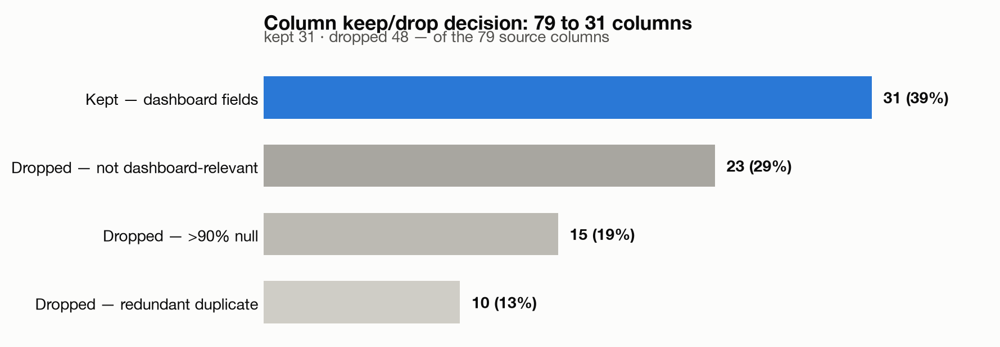
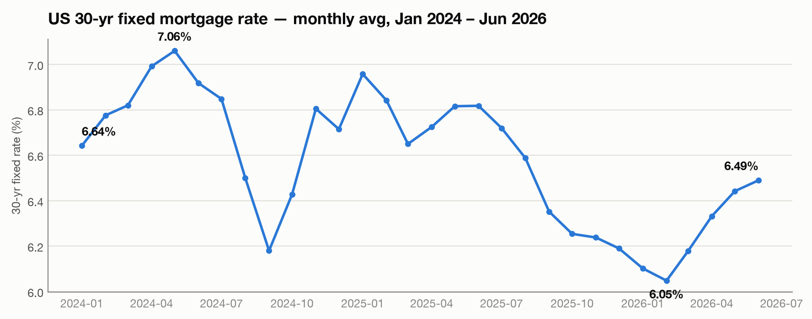
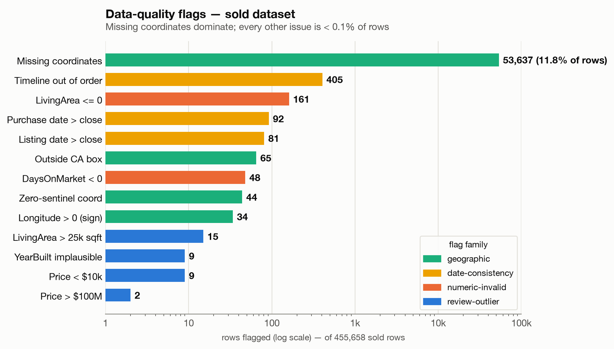
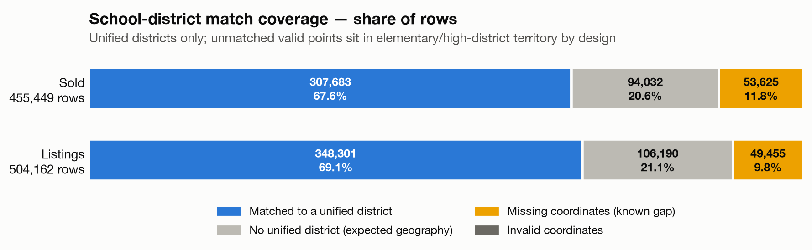
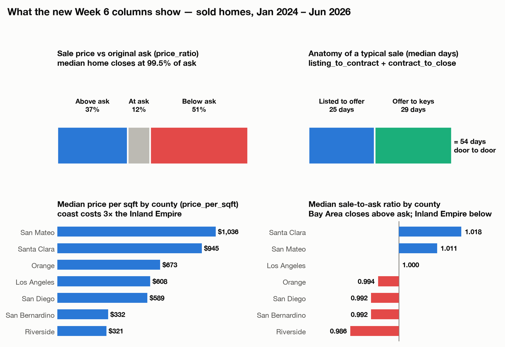
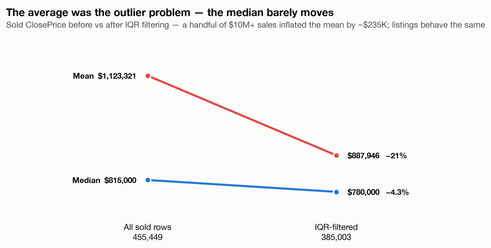
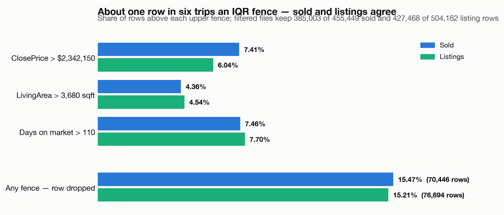

# IDX Exchange · Data Analyst Internship

Real estate market intelligence through MLS analytics.
Summer 2026 · Python · pandas · Tableau · CoreLogic Trestle API

## About

A 12-week data analyst internship at IDX Exchange, a real estate technology company, focused on turning raw CRMLS (California Regional Multiple Listing Service) data into market intelligence. The pipeline moves raw MLS pulls → Python extraction and consolidation → two canonical datasets → Tableau Public dashboards.

> No proprietary MLS data, API credentials, or client records are stored in this repository. Raw CSVs are produced and kept **local only**.

**Live dashboards:** [CA Market Analysis on Tableau Public](https://public.tableau.com/app/profile/emory.williams/viz/CAMarketAnalysis_17878744698360/MarketPulse)

## Objectives

- Pull **listings** and **sold** MLS records from the CoreLogic Trestle API.
- Maintain two canonical, ever-growing datasets — listings (everything on the market) and sold (only closed transactions) — as **separate pipelines**.
- Filter and standardize the data for analysis.
- Build and publish market dashboards on Tableau Public.

## Repository structure

```
week0/
  crmls_listed.py        # extraction → monthly listings CSV
  crmls_sold.py          # extraction → monthly sold CSV
week1/
  concatenate_monthly.py # combine all months → listings.csv + sold.csv (Residential only)
week2-3/
  common.py              # shared file-discovery + column keep-list (single source of truth)
  dataset_structuring.py # structure/validate sold, document types, filter, EDA, column-drop → reduced CSV
  mortgage_enrichment.py # merge FRED 30yr mortgage rate onto sold + listings → enriched CSVs
  make_figures.py        # README figures (column keep/drop, mortgage-rate line)
week4-5/
  data_cleaning.py       # type dates/numerics, flag quality issues, emit flagged + clean-view CSVs
  make_figures.py        # README figure (data-quality flag prevalence)
week6/
  feature_engineering.py # engineered market metrics + unified school-district spatial join → enriched CSV
  make_figures.py        # README figures (district coverage, new-column findings)
week7/
  iqr_outlier_filtering.py # IQR outlier flags on price/size/DOM → flagged + filtered CSVs
week8-10/
  make_extracts.py         # Week 7 flagged CSVs → Tableau .hyper extracts
  make_market_workbook.py  # generates market_analysis.twb (worksheets, dashboards, filters)
  market_analysis.twb      # the generated workbook STRUCTURE (XML — contains no data rows)
  make_competitive_extracts.py  # row-level + precomputed extracts for the competitive workbook
  make_competitive_workbook.py  # generates competitive_analysis.twb (ranked tables, zip heat maps, Brokerage Power)
  competitive_analysis.twb # generated structure (no data rows)
  img/                     # rendered previews of the published dashboard tabs
week11-12/
  make_report_pdf.py               # generates the 1-page report as a native PDF (reportlab)
  market_intelligence_report.pdf   # the submission-ready report
```

Data CSVs, Excel files, Tableau `.twbx` workbooks, and `.hyper` extracts are gitignored — this repo holds code and documentation only. The committed `.twb` is pure XML structure (chart definitions, no data rows); per the program's direction, the data-bearing workbook is published to Tableau Public rather than committed.

## The two-pipeline model

Two separate scripts, because listings and sold are two fundamentally different slices of the data:

- **Listings** — the full universe of properties placed on the market, regardless of outcome.
- **Sold** — the narrower subset that actually closed.

There are two canonical **raw** datasets — `listings.csv` and `sold.csv` — which each month's pull grows in place. Later stages derive enriched and cleaned versions *from* them (reduced → rate-enriched → flagged + clean-view; see Weeks 2–5), always as separate downstream artifacts, never by mutating the raw pair.

## Weekly workflow (end to end)

1. Run the two extraction scripts → update the two raw datasets.
2. Run the downstream stages (Weeks 2–7) to produce the enriched, flagged datasets.
3. Weeks 8–10: `make_extracts.py` packages the Week 7 flagged data into `.hyper` extracts, and the workbook generators write the Tableau workbooks as XML — opened and reviewed in **Tableau Public Desktop 2026.2**.
4. The generator's default build hides worksheets so only dashboards show as tabs (`--show-sheets` for a dev build with everything visible).
5. Publish to **public.tableau.com** from Tableau Public Desktop (File → Save to Tableau Public) — the program's progress surface for the Tableau weeks.

## How to run

Requires Python 3 with `requests` and `pandas` (plus `matplotlib` for the figure scripts).

```bash
pip install requests pandas matplotlib

# The Trestle proxy key is NOT stored in this repo — set it in your shell:
export TRESTLE_PROXY_KEY="<your IDX Exchange proxy key>"

# Week 0 — pull monthly files (defaults to 202602–202605; pass any YYYYMM args):
python3 week0/crmls_listed.py 202602 202603 202604 202605
python3 week0/crmls_sold.py   202602 202603 202604 202605

# Week 1 — combine all monthly files and filter to Residential.
# Point CRMLS_DATA_DIR at the folder of monthly CRMLS*.csv files:
export CRMLS_DATA_DIR="/path/to/monthly/files"
python3 week1/concatenate_monthly.py

# Weeks 2–3 — structure/reduce sold, then enrich both datasets with FRED rates:
export CRMLS_OUTPUT_DIR="/path/to/deliverables"
python3 week2-3/dataset_structuring.py
python3 week2-3/mortgage_enrichment.py

# Weeks 4–5 — type, flag, and emit flagged + clean-view CSVs
# (reads the Weeks 2–3 "With Rates" files from CRMLS_DELIV_DIR):
export CRMLS_DELIV_DIR="$CRMLS_OUTPUT_DIR"
python3 week4-5/data_cleaning.py

# Week 6 — engineered metrics + school-district join; Week 7 — IQR outlier flags:
python3 week6/feature_engineering.py
python3 week7/iqr_outlier_filtering.py

# Weeks 8–10 — build Tableau extracts + generate the market workbook
# (needs tableauhyperapi; the .twb opens in Tableau Public 2026.2):
pip install tableauhyperapi
python3 week8-10/make_extracts.py
python3 week8-10/make_market_workbook.py          # add --show-sheets for a dev build
python3 week8-10/make_competitive_extracts.py     # competitive extracts (row-level + precomputed)
python3 week8-10/make_competitive_workbook.py     # generates competitive_analysis.twb
open -a "Tableau Public" ~/idx-exchange/tableau/market_analysis.twb
open -a "Tableau Public" ~/idx-exchange/tableau/competitive_analysis.twb
```

---

## Weekly progress

### Week 0 — Extraction scripts

**Original brief:** the two extraction scripts were hardcoded to February 2026 and crashed with an `SSLEOFError` whenever the API dropped the connection. Both were rewritten so they:

- Accept one or more **`YYYYMM`** arguments from the command line (no more hardcoded month); output filenames derive from the month.
- Wrap every request in **retry + exponential backoff**, surviving dropped connections (the `SSLEOFError` / `SSLError` case, plus HTTP 429/5xx and mid-pull token expiry) instead of crashing.
- Read the API key from an **environment variable** rather than hardcoding it.

The scripts were then run to pull the Sold and Listing files for 202602–202605. Combined with the historical files retrieved via FileZilla, the team dataset now spans **January 2024 → May 2026**.

### Week 1 — Consolidation + Residential filter

**Deliverable:** `week1/concatenate_monthly.py` concatenates every monthly file (January 2024 through the most recently completed calendar month) into one **listings** and one **sold** dataset, filters both to `PropertyType == 'Residential'`, and writes the two CSVs — printing row counts at four checkpoints (before/after concatenation, before/after the filter) and recording them in the script's RUN LOG.

Observed on the 29-month set (Jan 2024 – May 2026):

| Dataset  | Monthly files | After concatenation | Residential (kept) |
|----------|--------------:|--------------------:|-------------------:|
| Listings | 29            | 729,251             | **480,383** (~66%) |
| Sold     | 29            | 655,362             | **438,115** (~67%) |

*(Totals as of the original 29-month set; June 2026 was added in Weeks 2–3 — see the lineage notes there.)*

**Interpretation & insights**

- **Two source encodings.** The historical FileZilla files are **Windows-1252**, while the API-extraction files are **UTF-8**. A naive read crashes on byte `0x92` (a smart quote). The script reads each file as UTF-8 with a **cp1252 fallback** and writes clean UTF-8 — a real data-quality gotcha the team should standardize on going forward.
- **Concatenation is lossless** — the sum of the individual files equals the concatenated count for both datasets, confirming no rows are dropped on load.
- **`PropertyType` categorization.** Keeping only `Residential` removes roughly a third of all rows. The categories filtered out are `ResidentialLease`, `Land`, `ResidentialIncome`, `ManufacturedInPark`, `CommercialSale`, `CommercialLease`, and `BusinessOpportunity`. `Residential` still spans every residential subtype (single-family, condo, townhouse, etc.).
- **Stable residential share** across both slices (~66–67%), a sensible baseline for the market-level dashboards to come.

### Weeks 2–3 — Dataset structuring/validation + mortgage-rate enrichment

Two scripts plus a shared `common.py` (single source of truth for file discovery and the column keep-list). The first inspects, validates, and reduces the **sold** dataset; the second enriches **both** datasets with mortgage rates. Data now spans **Jan 2024 – June 2026 (30 months)** — the June 2026 files are picked up via a `YYYYMM` dedup across two data folders so newly-arrived months integrate without double-counting stale duplicates.

**`week2-3/dataset_structuring.py`** reads the 30 monthly Sold files **un-filtered** (so the property-type mix can be documented and the Residential filter genuinely demonstrated), then: reports structure (680,885 rows × 79 cols), documents all 8 property types, applies `PropertyType == 'Residential'`, builds null tables **before and after** the filter (flagging >90%-null columns), produces a numeric distribution summary for `ClosePrice`/`LivingArea`/`DaysOnMarket`, answers six EDA questions, applies the **column-drop decision**, and saves the reduced dataset.

| Property type (sold) | Rows | Share |
|---|--:|--:|
| Residential | 455,658 | 66.92% |
| ResidentialLease | 157,408 | 23.12% |
| Land | 22,173 | 3.26% |
| ManufacturedInPark | 18,564 | 2.73% |
| ResidentialIncome | 18,521 | 2.72% |
| CommercialSale / CommercialLease / BusinessOpportunity | 8,561 | 1.26% |

<sub>Shares are rounded and may not sum to exactly 100%.</sub>

Residential filter kept **455,658** rows — an exact match to a teammate's independent 30-month result, asserted in-script as a continuity check (baseline lineage: 438,115 @ 29 mo → 455,658 @ 30 mo).

**Column-drop decision (79 → 31 columns).** Per the handbook clarification — drop columns >90% null, and keep only fields that feed the **Market Analysis** and **Competitive Analysis** dashboards — a 4-specialist review pruned the sold table to 31 columns: dropped **15** >90%-null columns plus **33** redundant/non-dashboard fields (kept one canonical each for id `ListingKey`, lot size `LotSizeSquareFeet`, list-agent `ListAgentFullName`; dropped amenities, schools, HOA, tax, address, co-agent, and originating-system fields).



**The 31 columns kept** (by dashboard purpose):

| Purpose | Columns |
|---|---|
| id / join key | `ListingKey` |
| price | `ClosePrice`, `ListPrice`, `OriginalListPrice` |
| dates + time-on-market | `CloseDate`, `ListingContractDate`, `PurchaseContractDate`, `DaysOnMarket` |
| status + product mix | `MlsStatus`, `PropertyType`, `PropertySubType` |
| size / attributes | `LivingArea`, `LotSizeSquareFeet`, `BedroomsTotal`, `BathroomsTotalInteger`, `YearBuilt` |
| geography | `CountyOrParish`, `City`, `PostalCode`, `StateOrProvince`, `MLSAreaMajor`, `Latitude`, `Longitude` |
| competitive — offices | `ListOfficeName`, `BuyerOfficeName` |
| competitive — agents | `ListAgentFullName`, `ListAgentAOR`, `BuyerAgentFirstName`, `BuyerAgentLastName`, `BuyerAgentMlsId`, `BuyerAgentAOR` |

**The 48 columns dropped** (by reason):

| Reason | Columns |
|---|---|
| >90% null (15) | `WaterfrontYN`, `BasementYN`, `FireplacesTotal`, `AboveGradeFinishedArea`, `TaxAnnualAmount`, `BuilderName`, `TaxYear`, `BuildingAreaTotal`, `ElementarySchoolDistrict`, `CoBuyerAgentFirstName`, `BelowGradeFinishedArea`, `BusinessType`, `CoveredSpaces`, `LotSizeDimensions`, `MiddleOrJuniorSchoolDistrict` |
| redundant duplicate (10) | `ListingKeyNumeric`, `ListingId` (→`ListingKey`); `LotSizeAcres`, `LotSizeArea` (→`LotSizeSquareFeet`); `ListAgentFirstName`, `ListAgentLastName` (→`ListAgentFullName`); `UnparsedAddress`, `StreetNumberNumeric`; `OriginatingSystemName`, `OriginatingSystemSubName` |
| not dashboard-relevant (23) | `Flooring`, `ViewYN`, `PoolPrivateYN`, `CoListOfficeName`, `CoListAgentFirstName`, `CoListAgentLastName`, `AssociationFeeFrequency`, `ElementarySchool`, `AttachedGarageYN`, `ParkingTotal`, `SubdivisionName`, `BuyerOfficeAOR`, `ContractStatusChangeDate`, `MiddleOrJuniorSchool`, `FireplaceYN`, `Stories`, `HighSchool`, `Levels`, `MainLevelBedrooms`, `NewConstructionYN`, `GarageSpaces`, `HighSchoolDistrict`, `AssociationFee` |

**`week2-3/mortgage_enrichment.py`** fetches the FRED `MORTGAGE30US` 30-year fixed series (weekly, no API key), resamples it to monthly averages (664 months, 1971→2026), rebuilds the reduced Residential sold + listings via `common`, and left-merges the rate on a `year_month` key (sold←`CloseDate`, listings←`ListingContractDate`). Validation confirmed **0 null rates** on both (455,658 sold, 504,466 listings; listings lineage: 480,383 @ 29 mo → 504,466 @ 30 mo).

Only the **30 months that overlap the MLS data (Jan 2024 – Jun 2026)** are joined onto transactions. Over that window the 30-yr fixed rate ranged **6.05% (Feb 2026, low) → 7.06% (May 2024, high)**, ending at **6.49%** (Jun 2026):



<sub>Source: FRED `MORTGAGE30US` (weekly, Freddie Mac) resampled to a monthly average.</sub>

| Month | Rate | Month | Rate | Month | Rate |
|---|--:|---|--:|---|--:|
| 2024-01 | 6.64% | 2024-11 | 6.80% | 2025-09 | 6.35% |
| 2024-02 | 6.78% | 2024-12 | 6.71% | 2025-10 | 6.25% |
| 2024-03 | 6.82% | 2025-01 | 6.96% | 2025-11 | 6.24% |
| 2024-04 | 6.99% | 2025-02 | 6.84% | 2025-12 | 6.19% |
| 2024-05 | **7.06%** | 2025-03 | 6.65% | 2026-01 | 6.10% |
| 2024-06 | 6.92% | 2025-04 | 6.72% | 2026-02 | **6.05%** |
| 2024-07 | 6.85% | 2025-05 | 6.82% | 2026-03 | 6.18% |
| 2024-08 | 6.50% | 2025-06 | 6.82% | 2026-04 | 6.33% |
| 2024-09 | 6.18% | 2025-07 | 6.72% | 2026-05 | 6.44% |
| 2024-10 | 6.43% | 2025-08 | 6.59% | 2026-06 | 6.49% |

**Insights**
- **`>90%`-null flags shift with the population** (14 columns before the filter, 15 after — `BuildingAreaTotal` only crosses the line once non-Residential rows are removed), so the report keeps a null table for each stage.
- **EDA surfaced real dirt for the Weeks 4–5 cleaning phase** (flagged, not fixed): `DaysOnMarket` as low as **−288**, `LivingArea` of **0** and up to **17M** sqft, and 81 sold records with `CloseDate` before `ListingContractDate`.
- **Market read (Residential sold):** median close price **$815K**; days-on-market median **19**; **39.5%** closed above list vs **42.8%** below; Bay-Area counties lead on median price (Del Norte tops the list but on a tiny sample — an outlier to treat with care).
- **The mortgage merge is a clean monthly join** — every transaction month is covered by FRED, so no rows fall through.
- **Adding June was a clean, verifiable increment** — the new totals reproduce a teammate's independent numbers to the row, confirming both pipelines agree.

### Weeks 4–5 — Data cleaning & preparation

**What this week does, in one sentence:** find every bad or suspicious value in the data, mark it, and remove only the rows that are truly impossible — so the analysis that follows can be trusted.

**`week4-5/data_cleaning.py`** works in three steps:

1. **Fix the column types.** Dates were stored as plain text; the script converts them into real dates so they can be sorted and compared. Numeric fields are confirmed to be real numbers.
2. **Mark problems instead of deleting them.** Every quality issue gets its own true/false **flag** column, so nothing is silently thrown away — a flagged row can always be inspected or filtered later.
3. **Save two files per dataset:**
   - a **flagged** file — every row kept, all flags attached (the audit trail), and
   - a **clean view** — the same data with only the *impossible* rows removed (a $0 sale, a 0-sqft home, negative days on market). Everything else stays in, flagged.

The flags fall into four groups:

| Group | What it catches | Example |
|---|---|---|
| Impossible numbers | Values that cannot be real. These are the **only** rows removed from the clean view. | price ≤ $0, size ≤ 0 sqft, negative days on market, negative beds/baths |
| Dates out of order | A sale can't close before it was listed. | close date earlier than listing date |
| Bad map coordinates | Missing, zeroed, or outside California. | longitude with the wrong sign |
| Worth a second look | Real-looking but extreme values, kept but flagged. | price under $10k or over $100M, home over 25,000 sqft |

Three details worth knowing: a row with a *missing* date is never flagged (it can't be checked, so it's "unaudited," not "clean"); the review thresholds are deliberately round numbers ($10k, $100M, 25k sqft) so anyone can understand and challenge them; and flags are saved as **0/1 integers** rather than True/False — easier to use in Tableau and consistent with the team's other files. The "dates out of order" flag counts *any* out-of-order pair (405 rows); the stricter "entire timeline reversed" reading catches just 1 row — both counts are printed so results stay comparable across the team.

> **"Clean" here means one specific thing:** free of impossible numbers. Rows with date or map issues are still in the clean view, carrying their flags — filter on a flag column if you want a stricter cut.



**What the flags found (sold dataset, 455,658 rows):**

| Issue | Rows | % of data |
|---|--:|--:|
| No map coordinates (`missing_coords_flag`) | 53,637 | 11.77% |
| Dates out of order (any kind) | 405 | 0.089% |
| Size recorded as 0 or negative | 161 | 0.035% |
| Purchase date after closing date | 92 | 0.020% |
| Listing date after closing date | 81 | 0.018% |
| Coordinates outside California | 65 | 0.014% |
| Negative days on market | 48 | 0.011% |
| Coordinates recorded as exactly 0 | 44 | 0.010% |
| Longitude has the wrong sign | 34 | 0.007% |
| Size over 25,000 sqft | 15 | 0.003% |
| Price under $10k | 9 | 0.002% |
| Year built implausible | 9 | 0.002% |
| Price over $100M | 2 | <0.001% |
| **Flagged for review (any flag)** | **54,126** | **11.88%** |
| **Impossible → removed from clean view** | **209** | **0.046%** |

Bottom line: only **209** sold rows (0.046%) were bad enough to remove, leaving a **455,449-row clean view**. Listings came out the same way: 304 removed from 504,466, leaving 504,162. (Some geographic counts overlap on purpose — a wrong-sign longitude is, by definition, also outside California.)

**What we learned**

- **The one real problem: missing map coordinates — and they're not missing at random.** About 12% of homes have no location point. Almost all of them are **2024 sales** (28% of that year is missing, vs. under 1% afterward), they cluster in **Bay-Area counties** (Santa Clara is 35% missing), and they skew **~$100K more expensive** than homes that do have coordinates. Plain consequence: a map built from this data quietly leaves out 2024, Northern California, and pricier homes. The fix: for anything grouped by geography, use the county/city/zip columns instead — those are 100% filled in.
- **Don't stack the two datasets.** About 94% of sold homes *also* appear in the listings file (a sold home was once listed — obvious in hindsight). Combining the files naively would count ~428K sales twice.
- **"Days on market" is not what you'd calculate yourself.** The MLS computes it from its own status events. It matches "close date minus list date" only about half the time. If you need your own duration math, do it on rows without the timeline flag.
- **The scary errors turned out to be tiny.** The −288 days-on-market, the 17-million-sqft "home," the sales that closed before listing — all real, all flagged, and all together just a few hundred rows out of 455K. One honest note: the removed 0-sqft homes are mostly *expensive* real sales (median ~$1.8M) where the size was simply never entered — so removing them trims a sliver off the luxury end.
- **Why flag instead of delete?** Because zero is sometimes legitimate: a home *can* sell in 0 days, land *can* have 0 bedrooms. Deleting on simple rules would throw away real data. So the script deletes only the impossible and marks everything else.
- One handbook field (`ContractStatusChangeDate`) isn't converted because we deliberately dropped it in Weeks 2–3 (it doesn't feed any dashboard). The code will pick it up automatically if it ever comes back.

### Week 6 — Feature engineering & market metrics

**What this week does, in one sentence:** build the calculated fields the dashboards will run on — price ratios, price per square foot, time-on-market breakdowns, and each home's school district — and save enriched datasets that the rest of the project uses.

**`week6/feature_engineering.py`** starts from the Weeks 4–5 clean views (455,449 sold homes + 504,162 listings) and adds eleven new columns to **both** datasets:

| New column | What it tells you |
|---|---|
| `price_ratio` / `close_to_original_list_ratio` | Sale price ÷ original asking price — did it sell over or under ask? (The handbook defines both names with the same formula, so both are provided from one calculation.) |
| `price_per_sqft` | Sale price ÷ living area — comparable pricing across home sizes |
| `days_on_market` | The raw MLS days-on-market field under the metric's standard name |
| `Year`, `Month`, `YrMo` | The sale month in dashboard-friendly form |
| `listing_to_contract_days` | How long from hitting the market to an accepted offer |
| `contract_to_close_days` | How long from accepted offer to keys-in-hand |
| `DistrictName` | Which **unified school district** the home sits in |
| `district_match_status` | Why a home has no district: no coordinates, bad coordinates, or a real location served by separate elementary/high districts |

**The school-district join, in plain terms:** we downloaded California's official 2025–26 school-district boundary map (936 districts), kept the 345 *unified* ones per the program's instructions, converted each home's latitude/longitude into a map point, and checked which district shape contains it. Results: **307,683 homes (67.6%) matched** a unified district; 20.6% sit in areas served by separate elementary + high districts (expected geography, not an error); 11.8% have no coordinates (the known gap from Weeks 4–5).



The join was verified four ways: known city→district pairs all check out (Irvine → Irvine Unified, San Diego → San Diego Unified, etc.); a **negative control** — Cupertino, which has *no* unified district — produced zero false matches; the match rate (76.6% of homes with coordinates) lands in the expected band; and the biggest district by sales is LA Unified, as it must be.

**What the new columns found**



- **The typical home closes at 99.5% of its original asking price** — but that near-1.00 median hides a split market: 37% close above ask, 51% below.
- **A typical sale takes ~54 days door to door**: 25 days to land an offer + 29 days of escrow. (The MLS's own "days on market" field says 19 — it measures active-marketing time under different rules, which is exactly why we documented both.)
- **The coast costs 3× the Inland Empire per square foot** — $1,036 (San Mateo) vs $321 (Riverside) — and the negotiation dynamics flip with it: Bay Area counties close *above* ask (Santa Clara 1.018), Inland Empire counties close *below* (Riverside 0.986).
- **Condos cost more per square foot than houses** ($562 vs $527) despite being cheaper overall — you pay a density premium for less space.

**Other findings**
- **Riverside County has the best district coverage in the dataset** — 84.3% of its sales matched a district and only 5.6% lack coordinates — which makes it the strongest candidate geography for the final market-intelligence report.
- **Because of the known coordinate gap, school district is best used as a dashboard *filter* with a coverage note, not as its own map** — the missing 12% is concentrated in 2024/Bay Area/pricier homes, so district-level stats would quietly undercount exactly those.
- Market snapshot from the segment tables: single-family homes median **$882K** and 17 days on market; condos **$625K** and 24 days; county medians run from **$535K** (San Bernardino) to **$1.65M** (San Mateo).
- The buyer-side segment table (competitive intelligence) surfaces a data gotcha for Week 9: the #3 "buyer office" is **`NONMEMBER MRML`** — a placeholder for purchases with no member buyer agent, not a real brokerage — so office rankings must exclude these sentinels.
- 405 homes have negative timeline durations — kept, because they carry the Weeks 4–5 timeline flag; and ~900 have no price ratio because the original list price was never recorded.
- **Cross-checked against teammates' Week 6 results:** buyer-office counts agree to within ~0.1%, and a teammate's single "unmatched district" total (147,693) equals our three separated buckets summed — same data, ours just labels *why* each row didn't match.

Output: `Week 6 _ Deliverable _ Sold Residential Enriched.csv` (455,449 × 62) and `Week 6 _ Deliverable _ Listing Residential Enriched.csv` (504,162 × 60) — the datasets every later week builds on — plus six small `Week 6 _ Segment _ <Dimension>.csv` files, one per summary table (each is exactly the top-10 table the script prints, saved for easy review in Excel). The segments cover every handbook dimension — PropertySubType, CountyOrParish, MLSAreaMajor, both office sides, and the combined **CountyOrParish × MLSAreaMajor** pair, whose top market is Southwest Riverside County (22,648 sales, $587K median).

### Week 7 — Outlier detection & data quality (IQR)

**What this week does, in one sentence:** find the statistical extremes in price, size, and time-on-market using the standard IQR method, mark them with flags, and produce a second "trend-friendly" version of each dataset with those extremes set aside — without deleting anything from the originals.

**`week7/iqr_outlier_filtering.py`** applies the textbook IQR rule to the three handbook fields — `ClosePrice`, `LivingArea`, `DaysOnMarket`. For each: find the 25th and 75th percentiles, take the gap between them (the IQR), and flag anything more than 1.5× that gap outside. Every row gets 0/1 flags (one per field + a combined one), and two files are saved per dataset:

- **IQR Flagged** — every row kept, flags attached (the originals are never touched);
- **IQR Filtered** — the same data minus the flagged rows, **for general market-trend charts only**.

**The before/after comparison (sold):**

| | Rows | Median price | *Mean* price | Median sqft | Median DOM |
|---|--:|--:|--:|--:|--:|
| Before (all rows) | 455,449 | $815,000 | $1,123,321 | 1,643 | 19 |
| After (filtered) | 385,003 | $780,000 | $887,946 | 1,570 | 16 |



And what each fence caught, side by side for the two datasets:



**What we learned**
- **All three fences are one-sided.** Housing data is right-skewed, so the "too low" thresholds go negative and flag nothing — only the luxury tail (>$2.34M), oversized homes (>3,680 sqft), and slow sales (>110 days) get flagged: **15.5%** of sold rows, **15.2%** of listings.
- **The median barely moves (−4%) but the mean collapses (−21%).** That's the whole lesson of this week in one line: a handful of $10M+ sales were dragging the average up by $235K. Medians were already telling the truth; means needed the filter.
- **The filter doesn't skew geography.** County flag rates are nearly flat (Riverside 15.4%, LA 16.4%, Orange 16.9%) — so trend charts built on the filtered file represent every county fairly.
- **But it does bite the investor tier via one fence:** in sub-$600K stock only the *days-on-market* fence fires (10.8%), and the slow-sale tail it removes is 40% sub-$600K. That's exactly the "stale listing" inventory investors buy — which is why **every investor/capstone metric stays on the flagged (pre-IQR) file**, a rule now printed by the script itself.
- Listings with no sale price (16% — still on the market) can't be price outliers; they pass through and stay.
- **The handbook's intro also names price-per-sqft and the close-to-list ratio as distortion-prone**, so the script reports a diagnostic for both (would-flag 4.1% and 9.4% respectively) without flagging them — the deliverable's three named fields define the filtered files, and most of those rows are already caught by the price/size fences anyway.
- **The tiered approach, explicitly:** tier 1 = business rules (done in Weeks 4–5: `ClosePrice <= 0` etc.), tier 2 = these IQR flags, tier 3 = the separate filtered file — raw records always preserved.
- One honest limitation, noted not fixed: fences are computed statewide. A $2.5M home is an outlier in Riverside but ordinary in parts of San Mateo — per-county fences would be the more rigorous upgrade, deferred to keep results comparable across the team.

Output: four CSVs — `Week 7 _ Deliverable _ {Sold, Listing} Residential IQR {Flagged, Filtered}.csv`. The script ends with the full observed output embedded as comments.

### Week 8 — Tableau dashboards, part 1: the market analysis workbook

**What this week does, in one sentence:** turn the cleaned data into the first required Tableau workbook — five monthly market dashboards plus one of our own design — with the entire workbook *generated by code*, not built by hand.

Two scripts in `week8-10/`:

1. **`make_extracts.py`** packages the Week 7 flagged datasets into Tableau's native extract format (`.hyper`) — 455,449 sold rows and 504,162 listing rows, trimmed to the columns the dashboards need. Dates are stored as true dates (string months would sort alphabetically — Apr, Aug, Dec — a classic silent bug).
2. **`make_market_workbook.py`** writes `market_analysis.twb` — the actual Tableau workbook — as XML: 6 worksheets, 6 dashboards (one per required view + "Rates and the Market"), each dashboard carrying the four required filters (City, County, Zip, PropertySubType) and a one-line data-provenance note.

**The nuance carried into every chart** (from the summer's locked rules): medians and counts use **all** rows (medians are robust; counts must never silently lose 15% of transactions), while the two *averages* — days on market and sale-to-ask ratio — run on the IQR-filtered base with a subtitle saying so (one 12,430-day artifact can move a monthly average by days). "Days on market" is the MLS system field, never date arithmetic. The own-design "Rates and the Market" pairs median price with the enriched national 30-yr mortgage rate as **two stacked panes on a shared month axis** — never a dual axis — with a note that the rate is national, so geographic filters move only the price line.

**How the build went — five validator iterations, all caught by the open-and-check loop:** missing `source-build` attribute; `window` elements need a `cards` block; dashboard zones need `id` attributes; two measures on a shelf join with `+` not a space; and the finale — Tableau dashboards use a **0–100,000 coordinate space**, so zones written in 0–100 rendered at 0.1% size (dashboards looked empty; they were microscopic). The last two fixes came from extracting ground truth out of Tableau's own bundled Superstore workbook instead of guessing: filter `level` attributes reference column-*instance* names (`[none:City:nk]`), quick filters need a `<slices>` shelf, and zone attributes are `type-v2`. The committed `market_analysis.twb` is the final validated structure.

**Result:** the workbook opens clean in Tableau Public 2026.2 — six worksheets rendering (median price ~$740K→$850K→$780–810K over 30 months, exactly matching the pipeline numbers), six dashboards with working filter cards, generated end-to-end by code.

**A data-quality catch the dashboards themselves surfaced:** the first live render of the ratio view showed monthly averages spiking to 170 — impossible for a close-to-list ratio. The cause: the Week 7 IQR flag fences price, living area, and days-on-market, but **not the ratio itself**, so 552 surviving rows (0.14% of the IQR-kept base) with data-entry ratios above 2× (worst case 1,077,419× — a $1 original list price) poisoned the average. The fix is a disclosed (0, 2] range filter on the ratio worksheet only: median ratio is exactly 1.0000, and the monthly average now lands where the market actually is, 0.98–1.02. This is exactly why the averages-need-guarding rule exists — and why medians never needed one.


**Deliberately not done yet:** nothing is published to Tableau Public — the `.twbx` lives locally until the data-policy confirmation arrives. The competitive workbook is Weeks 9–10.

### Week 9 — Tableau dashboards, part 2: rebuilt to the program's standard, and published

**A note on cadence.** Classes started this week, and I worked 30 hours in the final week of my other internship on top of a 15-credit-hour course load, so this repo fell about a week behind the team's Tableau pace. As of August 27 it is current again: the market workbook is rebuilt to the director's published standard, live on Tableau Public, and the code and this README are in sync with it. The catch-up used the same routine I'll run every week from here (see "How to update" below).

**What changed and why.** The director's guidance (desktop Fixed 1000×800, KPIs top-left, 3–5 charts per dashboard, one dropdown driving every chart, direct rounded labels, worksheets hidden on publish) and his reference workbook organize dashboards by *geography*, not by metric. The generator was rebuilt accordingly: six tabs — Market Pulse, County, City, Zip, New Listings, Rates and the Market — each with KPI tiles, linked filters (Tableau's `filter-group` mechanism, discovered in its bundled Superstore workbook), and precomputed rank columns in the extracts so "top-15 counties" and "top-8 property types" sort by value with plain range filters. All five required monthly views live on the geography tabs. Two of the six (all six in [week8-10/README.md](week8-10/README.md)):


**Where it lives now.** Per the program's August 24 direction, Tableau progress is shown on **Tableau Public**, not in committed workbook files: **[CA Market Analysis](https://public.tableau.com/app/profile/emory.williams/viz/CAMarketAnalysis_17878744698360/MarketPulse)** — six dashboard tabs, worksheets hidden. The repo keeps the generator code, the data-free `.twb` structure, and rendered previews.

**Sanity check against the team.** Reviewed against the director's reference workbook (*CA Market Analysis – Premium Edition*) and teammates' published workbooks: geography-organized tabs, KPI tiles top-left, direct rounded labels, one dropdown driving every chart, and desktop 1000×800 sizing all match the standard. The one feature a teammate has that this workbook doesn't yet is a **year-over-year overlay** (2024 / 2025 / 2026 on a single January–December axis) — queued for the next iteration alongside the Weeks 9–10 competitive workbook.

**The competitive workbook (Weeks 9–10), built the same way.** `make_competitive_extracts.py` resolves entities the way the program's case study prescribes (normalized office keys, agent = name + office, 255 placeholder records excluded from every ranking) and writes three extracts; `make_competitive_workbook.py` generates four tabs in the same structure the team's published competitive workbooks use: the top-100 listing agents and offices by units and by volume as ranked, directly-labeled bar charts (offices filterable by zip, property type, county, and city), two zip-code heat maps on Tableau's basemap (geocoded zips, filterable by month, the four dimensions, and — our addition — brokerage, so the required map doubles as a brand footprint map), and the own-design **Brokerage Power** tab — Compass share of listing sides 7.9% in 2026 H1 and still rising, Keller Williams and RE/MAX sliding, Real Broker and Equity Union doubling, and Opendoor's listing activity collapsing from 109 a month to 14. Details and the tab table are in [week8-10/README.md](week8-10/README.md).

**How to update this workbook from here (the weekly routine).**
1. New month of data → run the Weeks 1–7 stages → `python3 week8-10/make_extracts.py` (rebuilds the two `.hyper` extracts, including the rank columns).
2. `python3 week8-10/make_market_workbook.py` regenerates `market_analysis.twb` (worksheets hidden; add `--show-sheets` to inspect worksheets).
3. Open it in Tableau Public Desktop, check each tab against the numbers in the script RUN LOGs, then **File → Save to Tableau Public As…** under the same name to replace the published version.
4. Commit the generator + `.twb` + refreshed previews; the README's Week section gets the change note.

### Weeks 11–12 — Market Intelligence Report: "Prices froze; the competitive order didn't."

The 1-page report ([week11-12/market_intelligence_report.pdf](week11-12/market_intelligence_report.pdf), generated as a native PDF by [make_report_pdf.py](week11-12/make_report_pdf.py) — like the workbooks, the deliverable is written by code) follows the handbook's five required sections on Riverside County and carries the summer's central finding: **the median close price sat at exactly $600,000 — and $321 per square foot — for all thirty months of the window, while the competitive order changed underneath it.** Comparing like halves of the year, January–June listings jumped 14.1K → 14.4K → 17.7K (+23%) while January–June sales stayed flat within 18 transactions (1.08 → 1.10 → 1.36 listings per closed sale); a regional independent, Equity Union, now runs the county's #1 office in a 20-side dead heat with Coldwell Banker Realty and Compass; the last iBuyer wound down to 0.2% of listings; and across California the brokerage race is stratifying by price tier — Compass consolidating the mid tier (8.7→10.0% of listing sides), insurgents doubling in affordable-tier counties — with essentially no star-poaching: only 21 of 500, then 16 of 495, top producers changed brands year-over-year. Every figure is reproducible from the scripts in this repo; small-n figures are reported as raw counts, and 2026 is always labeled H1.
