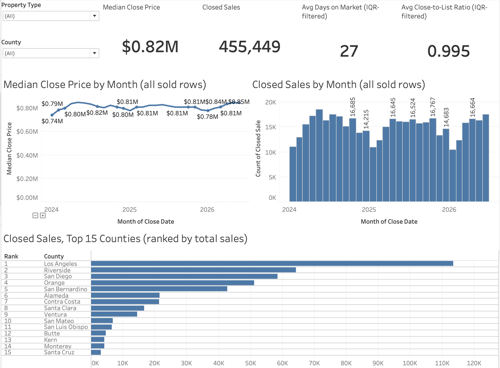
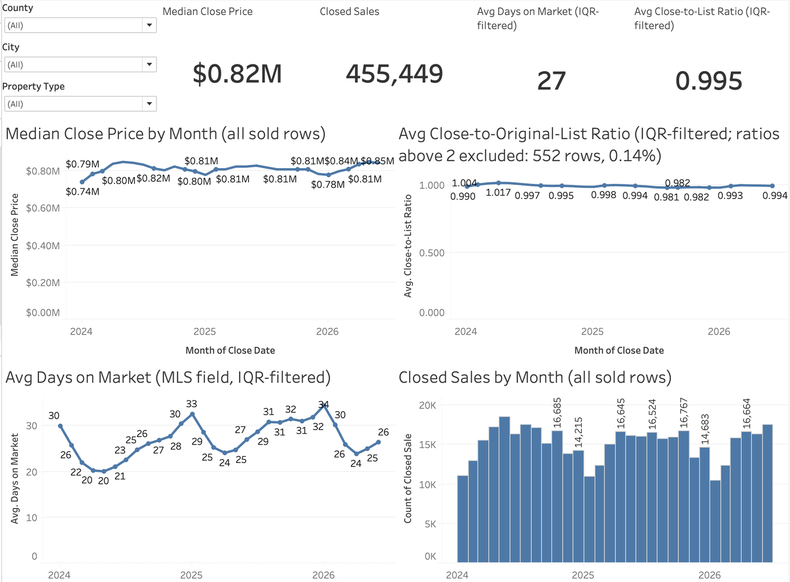
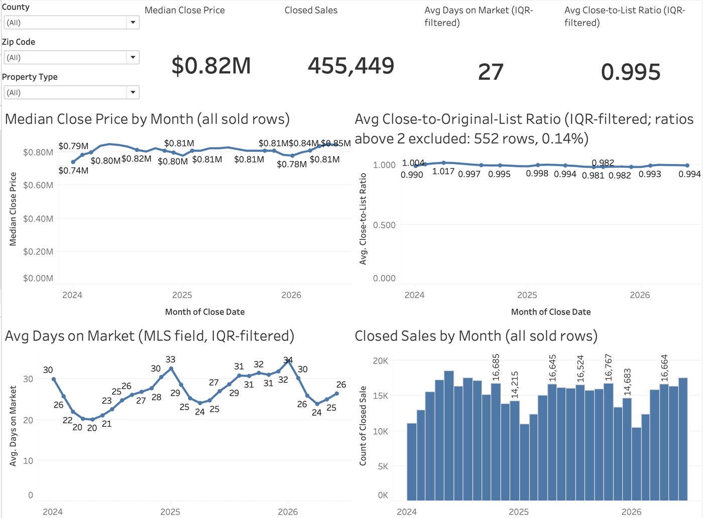
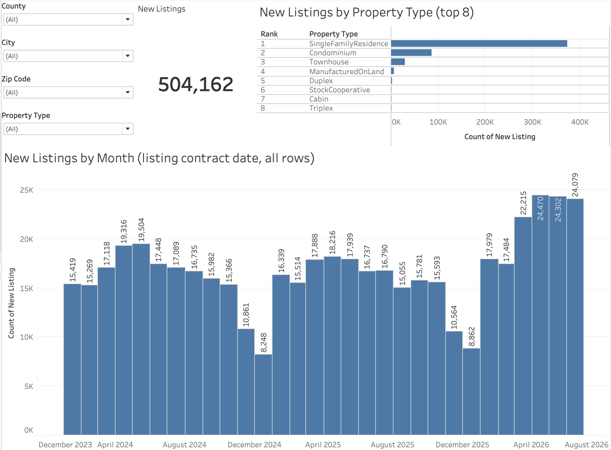
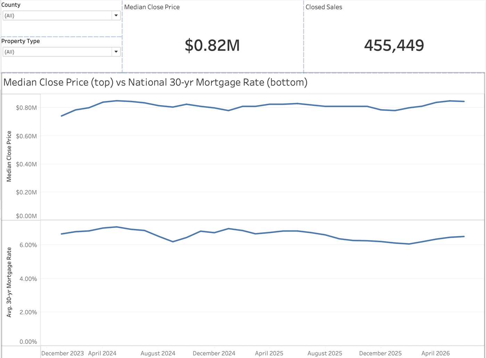
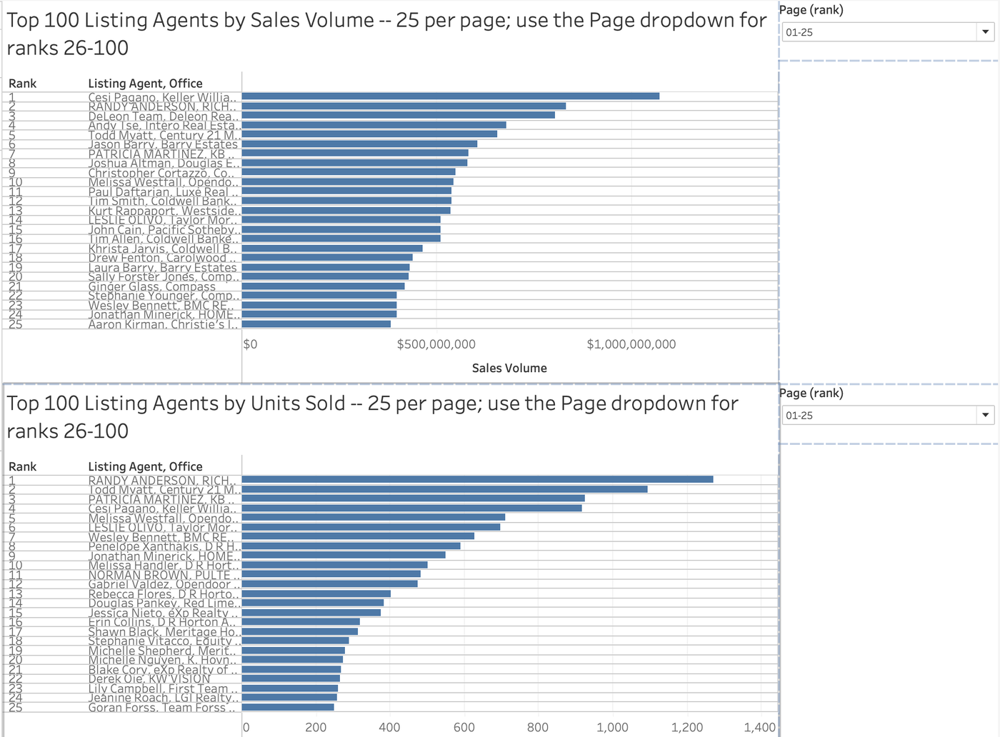
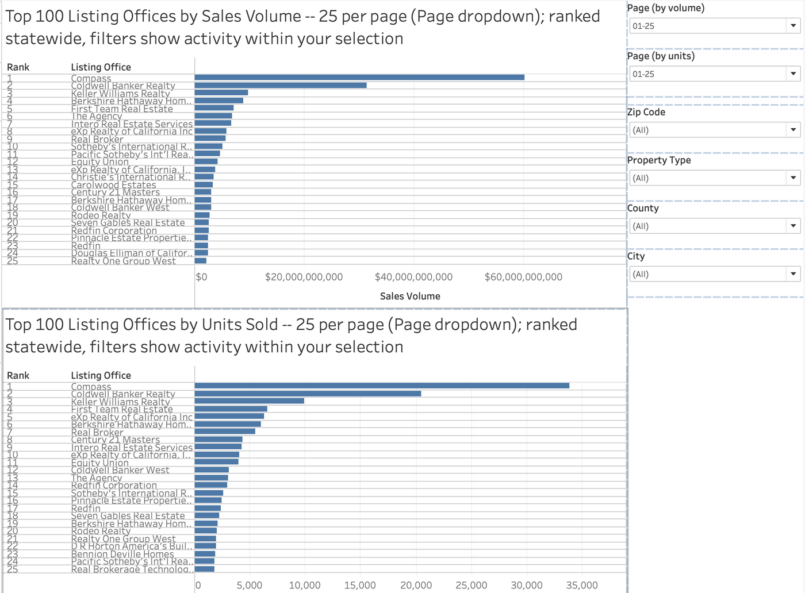
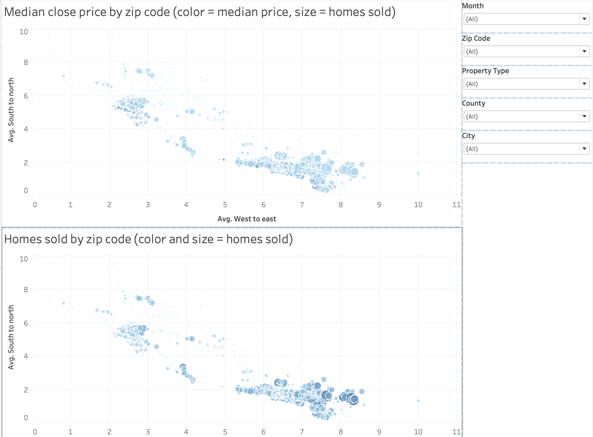
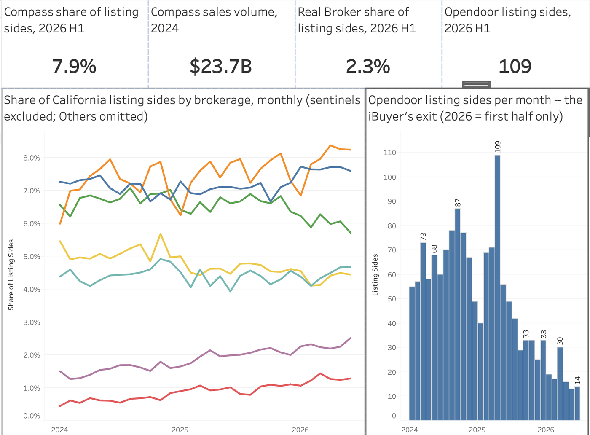

# Weeks 8–10 — Tableau Dashboard Development

**Goal:** the two required Tableau workbooks — `market_analysis` (Week 8–9 ✅) and `competitive_analysis` (Weeks 9–10 ✅) — built as **workbooks-as-code**: Python generates the data extracts and the workbook XML, Tableau just opens the result.

## What's in this folder

| File | What it is |
|---|---|
| `make_extracts.py` | Packages the Week 7 flagged datasets into Tableau's native extract format: `market_sold.hyper` (455,449 rows × 13 cols) and `market_listings.hyper` (504,162 × 8), including precomputed rank columns (county by closed sales, property type by listings) so ranked bar charts need only a range filter. Dates land as true dates — string months would sort alphabetically (Apr, Aug, Dec…), a classic silent bug. |
| `make_market_workbook.py` | Writes `market_analysis.twb` from scratch: 2 embedded-extract datasources, 13 worksheets (charts + KPI tiles), 6 geography-organized dashboards at Fixed 1000×800, linked filter cards, direct labels, provenance notes. `--show-sheets` builds a dev copy with worksheets visible. |
| `market_analysis.twb` | The generated workbook **structure** — pure XML, verified to contain **zero data rows**, which is why it can live in a public repo. The data-bearing `.twbx` and `.hyper` files are gitignored and stay local. |
| `make_competitive_extracts.py` | Builds the competitive extracts: a row-level sold extract with normalized office keys, sentinel flag and statewide ranks (455,449 × 15); a precomputed top-100 listing-agents table (156 rows — union of the units and volume rankings); and a monthly brokerage-share table (390 rows, 12 brands + Others). Documents the entity-resolution rules. |
| `make_competitive_workbook.py` | Writes `competitive_analysis.twb`: 12 worksheets, 4 dashboards (Top 100 Agents, Top 100 Offices, Zip Code Heatmaps, Brokerage Power). |
| `competitive_analysis.twb` | Generated structure of the competitive workbook — data-free XML. |

## The six dashboards (v2 — the program's dashboard standard)

Rebuilt Aug 27 to the director's published standard and reference workbook: **desktop Fixed 1000×800**, dashboards organized by **geography** with 3–5 charts each, **KPI tiles top-left**, **one dropdown driving every chart on the tab** (Tableau's `filter-group` linkage, generated), **direct rounded labels** ($0.82M / 0.995 / 27), and **worksheets hidden** so only the dashboards publish as tabs.

| Tab | The one question it answers | What's on it |
|---|---|---|
| **Market Pulse** | What is the California market doing right now, and where? | 4 KPIs (median price, closed sales, avg DOM, avg ratio) · median price by month · closed sales by month · top-15 counties by closed sales (ranked) |
| **County** | How is the selected county trending? | County + property-type dropdowns · 4 KPIs · median price · close-to-list ratio · days on market · closed sales |
| **City** | How is the selected city trending? | County + City + property-type dropdowns · same stack |
| **Zip** | How is the selected zip trending? | County + Zip + property-type dropdowns · same stack |
| **New Listings** | How much new supply is coming, and of what type? | 4 dropdowns (listings data) · KPI · new listings by month · top-8 property types (ranked) |
| **Rates and the Market** (own design) | Do CA prices move with the national 30-yr mortgage rate? | median price and the FRED rate as **two stacked panes** on a shared month axis — never a dual axis |

All five handbook-required monthly views (median close price, average DOM, average close-to-original-list ratio, new listings, closed sales) appear on the geography tabs, filterable by City / County / Zip / PropertySubType — the requirement attaches to the *views*, and organizing them by geography is how the director's own reference workbook does it.

**The nuance rule in one line:** medians and counts use *all* rows (counts must never silently lose 15% of real transactions); *averages* use the IQR-filtered base with a subtitle saying so, and the ratio additionally excludes 552 data-entry rows above 2× (0.14%, disclosed). Every tab carries a one-line provenance note.

## The six tabs, rendered

Market Pulse:



County:


City:



Zip:



New Listings:



Rates and the Market (own design):



## The competitive workbook (Weeks 9–10)

Four tabs, structured the way the team's published competitive workbooks are (ranked bar charts with direct labels, filter cards on the right, both maps on one tab), at the same Fixed 1000×800 standard as the market workbook:

| Tab | Handbook requirement | What's on it |
|---|---|---|
| **Top 100 Agents** | Top 100 listing agents by sales volume and units | Two ranked bar charts — by Sales Volume and by Units Sold — labeled "Rank · Agent, Office" with the value on every bar; statewide, precomputed |
| **Top 100 Offices** | Top 100 listing offices … filterable by city, county, zip, PropertySubType | Same two ranked bar charts for the statewide top-100 offices, with Zip / Property Type / County / City dropdowns on the right — filters show each office's activity within the selection |
| **Zip Code Heatmaps** | Zip-code heat maps of median close price and homes sold, filterable by month + the four dimensions | Two coordinate maps (one circle per zip at the mean coordinates of its sales; color = the measure, size = homes sold) with Month / Zip / Property Type / County / City dropdowns |
| **Brokerage Power** (own design) | One competitive dashboard of your own design | KPIs (Compass share of listing sides 2026 H1 **7.9%** · Compass 2024 volume **$23.7B** · Real Broker share **2.3%** · Opendoor listing sides 2026 H1 **109**) · monthly share lines for seven brands · Opendoor's listing sides by month |

**Entity resolution (documented in the extracts script):** office names upper-cased, trimmed, whitespace-collapsed (19,269 raw strings → 18,615 offices); agents keyed as name + office (the program case study's convention); 255 placeholder records (NONMEMBER etc., 0.06%) excluded from every ranking and share denominator. Units are closed sales (never outlier-filtered); volume is the sum of close price. Brokerage brands are resolved by contains-rules on the normalized office name (Compass, Keller Williams, Coldwell Banker, RE/MAX, eXp, Berkshire Hathaway, Century 21, Sotheby's, Redfin, Real Broker, Equity Union, Opendoor, Others). The zip maps use the rows' own latitude/longitude (88% coverage), so no geocoding step is involved.

**What it shows:** Compass is #1 by volume and still gaining share (7.3% → 8.0% of listing sides, 2024 → 2026 H1); Keller Williams and RE/MAX are losing share; Real Broker and Equity Union are the fastest risers; Opendoor's listing activity collapsed from a 109-a-month peak to 14 by mid-2026 (2026 shown as January–June only, never annualized).

The four tabs, rendered:









## How to run

```bash
pip install tableauhyperapi
python3 make_extracts.py           # writes the two .hyper extracts to ~/idx-exchange/tableau/
python3 make_market_workbook.py    # writes market_analysis.twb (add --show-sheets for a dev build)
python3 make_competitive_extracts.py   # competitive_sold / top_agents / brokerage_monthly .hyper
python3 make_competitive_workbook.py   # writes competitive_analysis.twb
open -a "Tableau Public" ~/idx-exchange/tableau/market_analysis.twb
open -a "Tableau Public" ~/idx-exchange/tableau/competitive_analysis.twb
```

## What it took — the five validator iterations

Hand-authoring Tableau's XML dialect surfaced five undocumented rules, each caught by the open-and-check loop (open the workbook, read Tableau's error/log, fix, regenerate):

1. `<workbook>` requires a `source-build` attribute
2. `<window>` elements require a `<cards>` block
3. Every dashboard `<zone>` requires an `id`
4. Two measures on a shelf join with `+`, not a space
5. **Dashboard zones use a 0–100,000 coordinate space** — zones written as 0–100 rendered at 0.1% size, making the dashboards look empty when they were actually microscopic

The last fixes came from **extracting ground truth from Tableau's own bundled Superstore workbook** instead of guessing: filter `level` attributes must reference column-*instance* names (`[none:City:nk]`, not `[City]`), quick filters need a `<slices>` shelf, and zone attributes are `type-v2`.

## Status & what's deliberately not here

- ✅ Workbook opens clean in Tableau Public 2026.2; KPI tiles read $0.82M / 455,449 / 27 days / 0.995 statewide (pipeline-matching); six dashboards with linked dropdowns, direct labels, and rounded formats, generated end-to-end by code.
- 🔧 Two more grammar rules learned in v2: a dashboard window must list a `viewpoint` for **every** sheet it contains (otherwise "sheet has no visual representation"), and a KPI tile is an empty-shelf sheet with the measure on Text and its font set at the worksheet `cell` level.
- 📤 **Published:** [CA Market Analysis on Tableau Public](https://public.tableau.com/app/profile/emory.williams/viz/CAMarketAnalysis_17878744698360/MarketPulse) — per the program's August 24 directive (Tableau progress lives on Tableau Public rather than in committed workbook files); worksheets hidden, dashboards as tabs, desktop layout.
- ✅ Weeks 9–10: `competitive_analysis` built (ranked bar charts, coordinate zip maps, Brokerage Power). Grammar learned: the 2026 validator rejects the old `computed-sort` element (charts are ordered by precomputed rank columns instead); Tableau's auto-generated map geometry can't be authored from code, so the zip maps plot the rows' own coordinates; a window's sheet names must be unique across worksheets and dashboards; a viewpoint without a `zoom` element gives a sheet its natural size so long bar charts scroll instead of squeezing.
