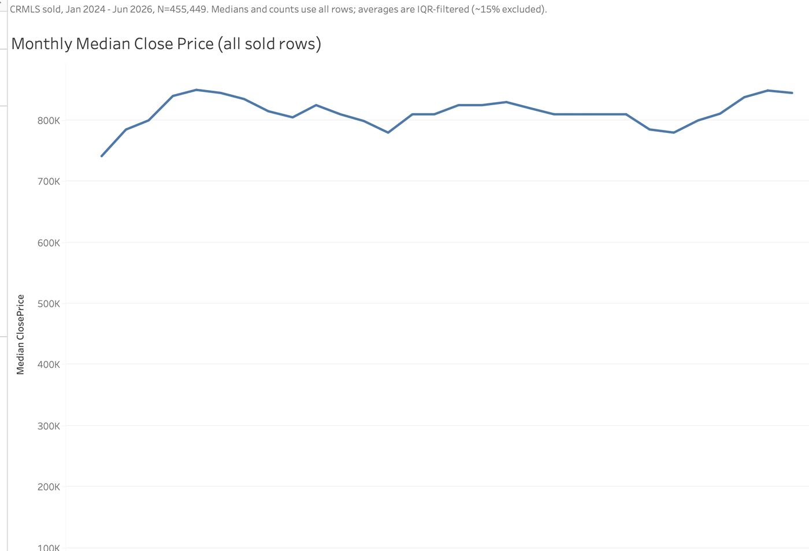
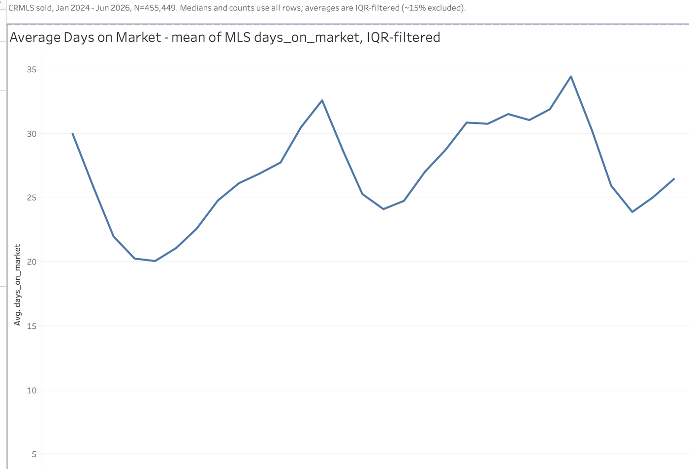
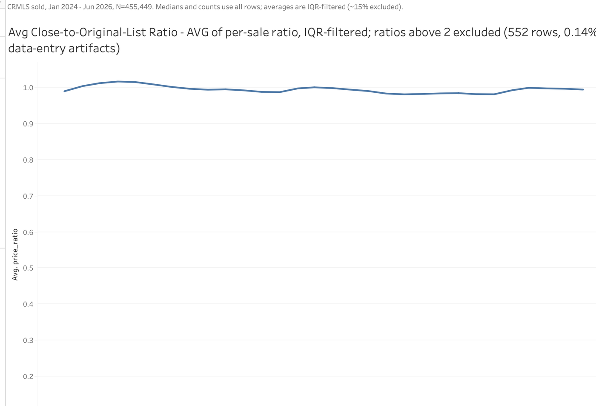
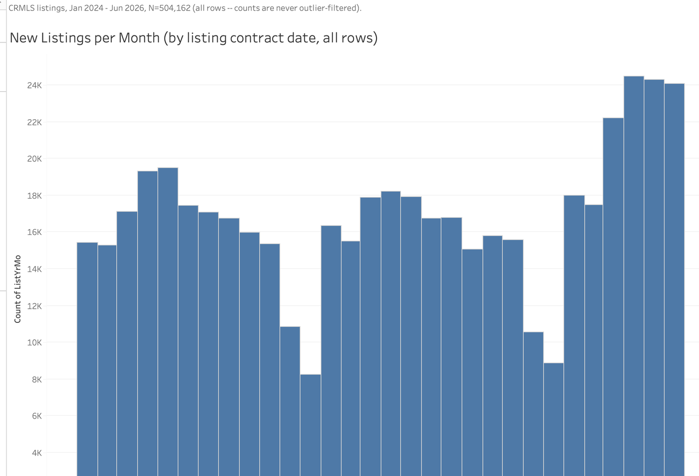
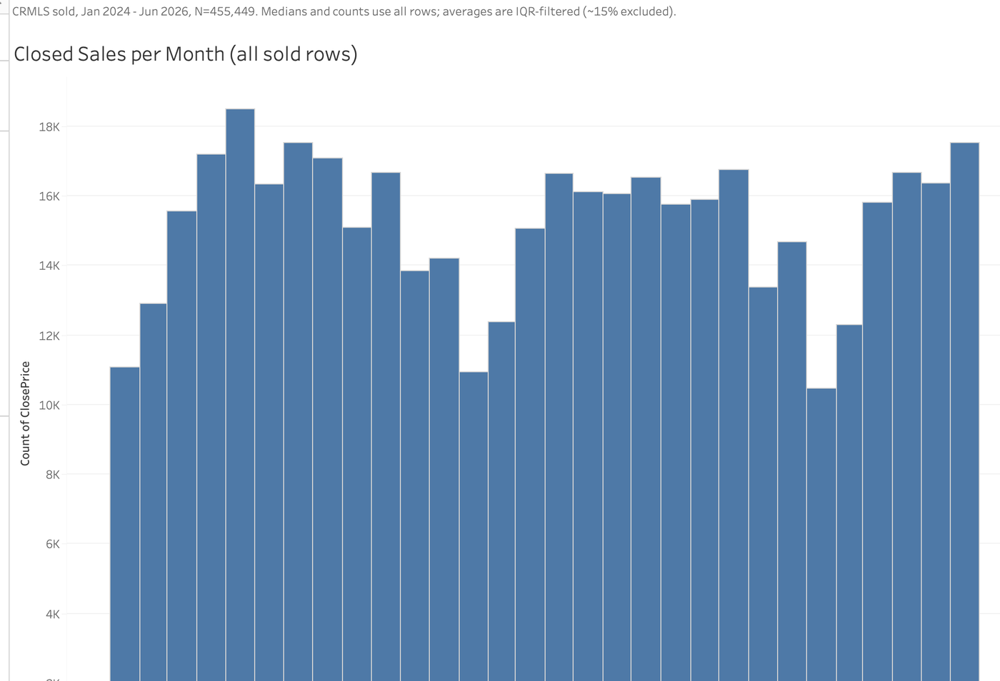
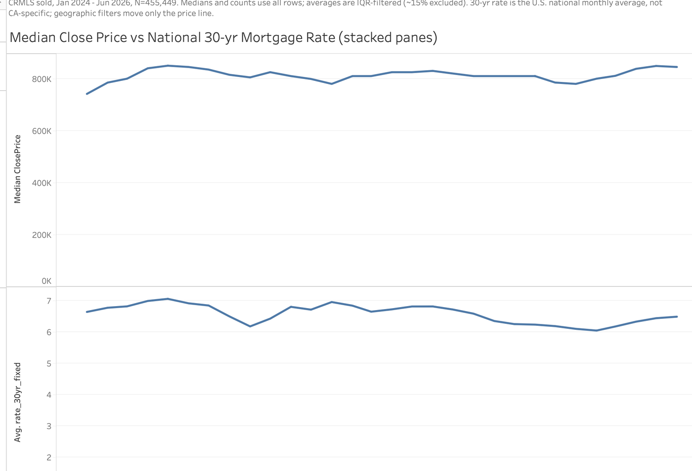

# Weeks 8–10 — Tableau Dashboard Development

**Goal:** the two required Tableau workbooks — `market_analysis.twbx` (this folder, Week 8 ✅) and `competitive_analysis.twbx` (Weeks 9–10, upcoming) — built as **workbooks-as-code**: Python generates the data extracts and the workbook XML, Tableau just opens the result.

## What's in this folder

| File | What it is |
|---|---|
| `make_extracts.py` | Packages the Week 7 flagged datasets into Tableau's native extract format: `market_sold.hyper` (455,449 rows × 12 cols) and `market_listings.hyper` (504,162 × 7). Dates land as true dates — string months would sort alphabetically (Apr, Aug, Dec…), a classic silent bug. |
| `make_market_workbook.py` | Writes `market_analysis.twb` from scratch: 2 embedded-extract datasources, 6 worksheets, 6 dashboards, filter cards, provenance notes. |
| `market_analysis.twb` | The generated workbook **structure** — pure XML, verified to contain **zero data rows**, which is why it can live in a public repo. The data-bearing `.twbx` and `.hyper` files are gitignored and stay local. |

## The six dashboards

The five required monthly views (Jan 2024 – Jun 2026, each filterable by City, County, Zip, and PropertySubType) plus one of our own design:

1. **Monthly Median Close Price** — line; all rows (medians are robust to outliers)
2. **Average Days on Market** — line; IQR-filtered, because one 12,430-day artifact moves a monthly mean by days
3. **Average Close-to-Original-List Ratio** — line; IQR-filtered **plus a (0, 2] ratio range filter**. The IQR flag fences price/area/DOM but not the ratio itself, and 552 surviving rows (0.14%) carry data-entry ratios above 2× (max: 1,077,419× — a $1 original list price), enough to push a monthly average to 170.95. With the range filter the line sits where it should: 0.98–1.02 (median ratio is exactly 1.0000). The exclusion is disclosed in the chart subtitle.
4. **New Listings** — bars; counted by *listing* date, all rows
5. **Closed Sales** — bars; counted by *close* date, all rows
6. **Rates and the Market** (own design) — median price and the national 30-yr mortgage rate as **two stacked panes** on a shared month axis (never a dual axis); uses the FRED enrichment from Weeks 2–3

**The nuance rule in one line:** medians and counts use *all* rows (counts must never silently lose 15% of real transactions); *averages* use the IQR-filtered base with a subtitle saying so. Every dashboard carries a one-line provenance note disclosing the split.

## The six dashboards, rendered

1 — Monthly Median Close Price (all rows):



2 — Average Days on Market (IQR-filtered):



3 — Average Close-to-Original-List Ratio (IQR-filtered + disclosed (0, 2] ratio bound):



4 — New Listings by listing contract date (all rows):



5 — Closed Sales by close date (all rows):



6 — Rates and the Market (own design — stacked panes, never a dual axis):



## How to run

```bash
pip install tableauhyperapi
python3 make_extracts.py           # writes the two .hyper extracts to ~/idx-exchange/tableau/
python3 make_market_workbook.py    # writes market_analysis.twb
open -a "Tableau Public" ~/idx-exchange/tableau/market_analysis.twb
```

## What it took — the five validator iterations

Hand-authoring Tableau's XML dialect surfaced five undocumented rules, each caught by the open-and-check loop (open the workbook, read Tableau's error/log, fix, regenerate):

1. `<workbook>` requires a `source-build` attribute
2. `<window>` elements require a `<cards>` block
3. Every dashboard `<zone>` requires an `id`
4. Two measures on a shelf join with `+`, not a space
5. **Dashboard zones use a 0–100,000 coordinate space** — zones written as 0–100 rendered at 0.1% size, making the dashboards look empty when they were actually microscopic

The last fixes came from **extracting ground truth from Tableau's own bundled Superstore workbook** instead of guessing: filter `level` attributes must reference column-*instance* names (`[none:City:nk]`, not `[City]`), quick filters need a `<slices>` shelf, and zone attributes are `type-v2`.

## Status & what's deliberately not here

- ✅ Workbook opens clean in Tableau Public 2026.2; worksheets render with pipeline-matching numbers (median price ~$740K → $850K → $780–810K across the 30 months); dashboards populated with working filters.
- 📤 **Publishing goes to Tableau Public** per the program's August 24 directive (show Tableau progress on Tableau Public rather than committing workbook files). Published per the program's guidance: worksheets hidden, dashboards only, desktop layout.
- ⏭️ Weeks 9–10: `competitive_analysis.twbx` — top-100 agents/offices (where the office-name normalization and NONMEMBER-sentinel exclusion get used), the two zip-code heat maps, and the competitive own-design dashboard.
